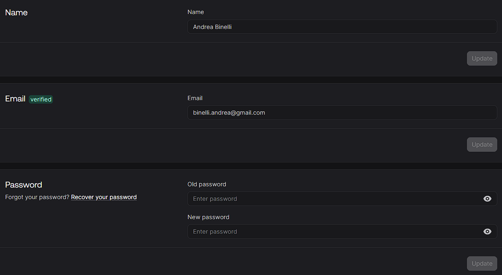
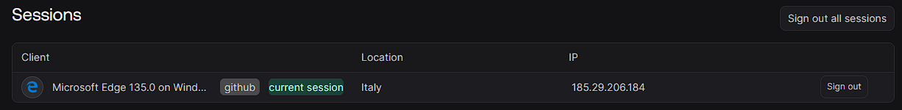

- in `/root/workspace/brewapp-mono/old-examples` ci sono vecchi progetti MVP fatti nel 2025, spesso abbandonati e incompleti
- ho generato una deep-wiki che li spiega in linguaggio umano `/root/workspace/enibrn-brewapp-mono-DeepWiki`. Accedi a questo prima di cercare il codice specifico.
- Ogni milestones può consistere in vari task e serve per arrivare ad un punto stabile dello sviluppo
- il plan di una milestone deve tenere in considerazione:
  - milestone in esame
    - cercare anche nella deep-wiki
    - ma non andare ad esplorare direttamente `brewapp-mono/old-examples`: lo farà l'esecutore del task nel caso gli servano esempi
  - milestone passate
    - leggere eventualmente anche i runbook.md, i plan non dovrebbero servire
  - milestone future
    - per la bigger picture, ed evitare di creare artifatti inutili/controproducenti/da dover eliminare o riscrivere.

## elenco milestones

### 1) skeleton: nuxt3 + vuetify3: DONE

- app nuxt3 con vuetify3
    - esiste il 4 per entrambi ma voglio partire a gradi
    - tanto sono entrambi LTS
    - ci sarà una milestone in futuro per aggiornare al 4 entrambi
    - nuxt 3 ha una impostazione per renderlo già future-compatibile con il 4
- no SSR per adesso, disabilitarlo
- auth workflow (login, register), implementazione dummy, predisposto come layer di astrazione per un baas (es appwrite, supabase)
- non esternalizzare in un pacchetto esterno l'integrazione con il baas (come troverai in uno degli esempi). Fare un monolite modulare facilmente esternalizzabile in seguito
- blueprint darkmode per l'homepage:
```vue
<template>
  <v-app id="inspire">
    <v-system-bar>
      <v-spacer></v-spacer>

      <v-icon>mdi-square</v-icon>

      <v-icon>mdi-circle</v-icon>

      <v-icon>mdi-triangle</v-icon>
    </v-system-bar>

    <v-app-bar>
      <v-app-bar-nav-icon @click="drawer = !drawer"></v-app-bar-nav-icon>

      <v-app-bar-title>Application</v-app-bar-title>
    </v-app-bar>

    <v-navigation-drawer
      v-model="drawer"
      temporary
    >
      <!--  -->
    </v-navigation-drawer>

    <v-main class="bg-grey-lighten-2">
      <v-container>
        <v-row>
          <template v-for="n in 4" :key="n">
            <v-col
              class="mt-2"
              cols="12"
            >
              <strong>Category {{ n }}</strong>
            </v-col>

            <v-col
              v-for="j in 6"
              :key="`${n}${j}`"
              cols="6"
              md="2"
            >
              <v-sheet height="150"></v-sheet>
            </v-col>
          </template>
        </v-row>
      </v-container>
    </v-main>
  </v-app>
</template>

<script setup>
  import { ref } from 'vue'

  const drawer = ref(null)
</script>

<script>
  export default {
    data: () => ({ drawer: null }),
  }
</script>
```
- icona generica in alto a destra in sysbar per l'utente: quando si clicca si apre una tendina con l'opzione di logout
- test e2e con alcuni usecase: l'utente si registra, l'utente si logga, l'utente si slogga

### 2) form driven design: aggiunta json forms

- https://github.com/eclipsesource/jsonforms/blob/master/packages/vue-vuetify/README.md
- implementare json-forms. Se viene difficile implementare i json-forms-vuetify-renderers allora fare renders custom
- gli unici due form saranno quello di login e register
- gestione degli errori: granularità a livello di campo oppure a livello generale a livello di form (errori non attribuibili a un sigolo campo, errore rosso generico vicino al submit del form)
- i test e2e devono ancora passare, aggiungere anche i casi in cui ci sono errori

### 3) baas integration: metodi auth di apprwrite

- selfhosting appwrite in locale con docker: da fare esternamente al progetto
- implementazione con primo baas: alle interfacce prima definite ci sarà l'implementazione con apprwrite
- servirà un adapter per far corrispondere gli errori da appwrite server attribuibili al singolo campo, se è possibile. Altrimenti farli uscire come errore generico del form
- di fatto login e register funzioneranno con un utente vero, che si registra e poi si logga/slogga
- capire se occorre gestire separatamente il profilo dalla sessione (negli esperimenti c'era qualcosa del genere)
- tenere conto che prima o poi va implementato anche supabase! Quindi non fare un wrapper troppo specifico! Negli esempi c'era una repo con sia supabase che appwrite

### 4) il primo crud semplice (no backend)

- il primo crud vero da implementare sarà un form che si apre cliccando su voce della tendina dell'utente, prima di logout
- saranno le impostazioni dell'utente che è possibile aggiornare per appwrite, simile alla schermata che vedo su appwrite

- prendere spunto dai crud di jsonforms https://jsonforms.io/examples/basic
- capire come rendere il componente form riutilizzabile
  - vorrei passare come parametri: Schema, UI Schema, eventualmente Data (per precompilarlo)
  - la view/componente che chiama questo componente ha come responsabilità passargli questi parametri
- senza submit! non troppa carne al fuoco

### 5) finalizzazione del crud

- tasto submit (Salva)
- i dati vengono precaricati sulla modifica (in questo caso l'inserimento new non c'è perché l'utente esiste quindi quel form ha sicuramente dei dati precompilati)
- implementazione dummy (è tutto in memoria, usare dei file json senza complicarsi la vita)
- con implementazione backend: il form ora salva effettivamente i dati nel database di appwrite

### 6) il secondo crud, lista

- lista delle sessioni attive per l'utente
- Prendere spunto dalla lista delle sessioni di appwrite

- usare una vdatatable vuetify
- azione: possibile eliminarle (se eliminazione della corrente fa signout)
- anche qui capire come fare la lista in modo intelligente: potrei wrapparla con un mio componente? vedi milestone successiva
- dati dummy: non pescati dal backend

### 7) finalizzazione della lista

- gestione intelligente dei filtri
- dati presi con una get dal backend

### 8) la lista con dettagli: complessa

- la lista con dettaglio combina le due milestone precedenti
- è possibile aggiungere gli elementi con form in popup vuota
- è possibile editare gli elementi con form in popup precompilata
- prendere come spunto la https://v3.vuetifyjs.com/en/components/data-tables/basics/#crud-actions

## 9) aggiornamenti a nuxt4/vuetify4

- autoesplicativo
- seguire le guide ufficiali di migrazione
- controllare tramite tutti i test che tutto funzioni come prima

## 10) esternalizzazione dell'app

- indagare se conviene farlo con i layers: l'app reale fa extends del template
  - https://nuxt.com/docs/4.x/getting-started/layers
- mie idee
  - si passa un config personalizzabile: puntamenti al backend (un occhio alla sicurezza), nome dell'applicazione (non mi viene in mente altro)
  - nell'app si hanno le viste che referenziano i componenti del template (es il form crud a cui la vista deve passare le prop relative allo schema, ui-schema, dati)
- app reale esempio: dummmy per verificare funzionamento

## 11) vue flow pt1 - canvas

- continuare app reale di esempio
- anagrafica inserimento elementi: lista crud
- l'elemento ha nome, desc e tag (sistema veloce per aggiungere tag e associare quelli esistenti)
- quando inserisco l'elemento, devo poter caricare un immagine e definire i punti di ancoraggio per il successivo schema
- quando carico l'immagine ci dev'essere un wizard di importazione e la normalizzazione
  - Rimozione dello Sfondo (Il "Magic Wand"), approccio moderno (AI in-browser)
  - Auto-ritaglio (Crop sui bordi dell'oggetto)
  - Dimensionamento e Scala -> definire la larghezza o l'altezza dell'oggetto 2D (l'altro parametro viene calcolato) -> salvo a db l'immagine e un fattore di scala

Esempio pratico:
Il wizard chiede: "Qual è la larghezza reale di questo oggetto in cm?"
L'utente inserisce "50" (cm).
Il tuo codice fa la proporzione: se l'immagine ritagliata è larga 500 pixel, significa che 10 pixel = 1 cm.
In questo modo salvi a database un "fattore di scala" (es. pixelsPerCm = 10) associato a quell'immagine.
Quando la trascinerò nel canvas principale (che avrà una sua scala globale), tutti gli oggetti avranno il giusto

## 12) vue flow pt2 - collegamenti e simulazione

- prendere sputno da google draw: connettori diretti, a gomito, curvi
- si agganciano ai punti di ancoraggio
- bisogna salvare lo stato del diagramma
- bisogna rappresentare il flusso, devo poter disattivare gli attori (es rubinetto chiuso, acqua non passa)

## Futuro

### Lato tecnico

- SSR per performance (una o due milestones)
- localizzazione (caption, messaggi errori/warning/info) (una o due milestones)
- versione mobile android con https://github.com/nuxt-modules/ionic (varie milestones)

### App reali

ognuna delle quali richiede splittarla in milestones

- app per simulare sistema a osmosi inversa/birrificazione
- app basata su json schema per calcolare ricette -> https://github.com/beerjson/beerjson
